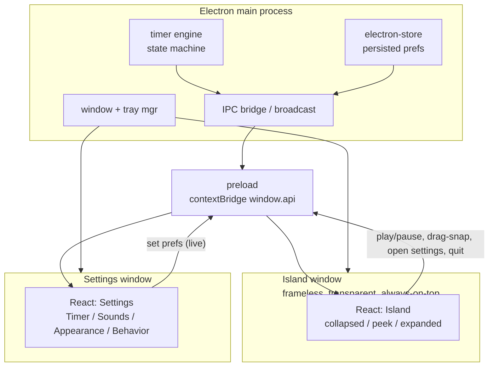

# Dynamic Island Pomodoro — Implementation Plan

## Goal

Recreate the handoff (`Dynamic Island Pomodoro.dc.html` + its imports `Island`, `Settings`, `NotchConcept`, `RippleConcept`) as a real Electron desktop app in the empty `pomisland/` workspace. Match the visual output exactly; do not copy the prototype's `DCLogic`/`dc-import` plumbing.

## Architecture

State ownership:

- Main process owns the **timer runtime** (`status, mode, total, remaining, sessionIndex`) and **persisted prefs** (everything in the Settings window). Both windows subscribe via IPC and render; all mutations go back through IPC. This is why a single accent/theme change in Settings instantly reskins the island.

## Stack & scaffolding

- `electron-vite` (Vite + React + TS, multi-renderer), `electron-builder` for packaging, `electron-store` for persistence.
- Fonts bundled offline via `@fontsource/fraunces`, `@fontsource/inter`, `@fontsource/ibm-plex-mono` (handoff loads these three from Google Fonts in `tokens/fonts.css`).
- Two renderer entries: `index.html` (island) and `settings.html` (settings).

## Design tokens (ported verbatim)

Port the Folio tokens from the bundle into `src/shared/tokens.css` — colors (`colors.css`), typography (`typography.css`), spacing/radii/motion (`spacing.css`). Add the island's own dark palette + accent logic extracted from `Island.dc.html` `renderVals`:

- focus accent `#8FC8C0` (overridden by user accent), break `#E2A24A`, final-minute urgent `#ECB24E`; `accentBright`/`accentSoft` derivations; island surface `#17191D`, text `#F2F1EC`.

## Files to create

### Main process (`electron/`)

- `main.ts` — app lifecycle, create island window + tray, register IPC.
- `windows.ts` — factories:
  - island: `frame:false, transparent:true, alwaysOnTop:true, skipTaskbar:true, resizable:false, hasShadow:false`, pinned top-center; **auto-resizes** to fit content (collapsed pill ≈ small, peek 266px, expanded 320px) via a `resize` IPC from a renderer `ResizeObserver`.
  - settings: `780×600` (design hint), frameless, draws the titlebar/traffic-lights from `Settings.dc.html` wired to real close/minimize/zoom.
- `timer.ts` — state machine ported from `Dynamic Island Pomodoro.dc.html` (250ms tick, `playPause/reset/skip/complete/advance/switchMode`, long break every `longEvery`), driven by persisted durations; broadcasts state on change.
- `store.ts` — `electron-store` schema + defaults mirroring `Settings.dc.html` state (durations, presets, automation, sounds, appearance, behavior toggles, `theme`, `accent`).
- `ipc.ts` — channels: `timer:state` (broadcast), `timer:action`, `prefs:get/set/changed`, `island:resize`, `island:drag/snap`, `window:settings.open`, `app:quit`.
- `preload.ts` — `contextBridge` exposing typed `window.api`.

### Shared (`src/shared/`)

- `types.ts` — `TimerState`, `Prefs`, IPC contracts.
- `tokens.css` — ported Folio tokens + island palette.
- `format.ts` — `mm:ss`, `frac`, accent resolution, micro-message selection (ported from `Island.dc.html`).

### Island renderer (`src/island/`)

- `main.tsx`, `IslandApp.tsx` — subscribe to `timer:state` + `prefs`, host drag/snap, render `Island`.
- `Island.tsx` — three modes pixel-matched to `Island.dc.html`:
  - **collapsed** pill (min-height 44px, gap 11px; layouts `split`/`minimal`/`compact` toggle ring/time/dots per `showRing`/`showTimeText`),
  - **peek** card (266px, task + progress bar + play/skip),
  - **expanded** panel (320px, 64px ring, 38px time, micro-message, reset/play/skip + ⋯ menu).
- `Ring.tsx`, `SessionDots.tsx`, `Glyphs.tsx`, `Menu.tsx` (switch mode / settings / quit + "encouraging messages" toggle).
- `animations.css` — `islandBreathe`, `islandRipple A/B/C`, `islandGlow`, `islandPop`, `islandConfetti`, urgent amber; completion animation switched by the `anim` pref (`ripple`/`bloom`/`heartbeat`/`confetti`/`none`) using `RippleConcept` timings.
- Drag + **magnetic snap**: dragging moves the island window; near top-center shows the snap glow + "DROP TO SNAP" hint and snaps to the notch (logic ported from `startDrag/onDrag/endDrag`).

### Settings renderer (`src/settings/`)

- `main.tsx`, `SettingsApp.tsx` — sidebar (Timer / Sounds & Alerts / Appearance / Behavior) + titlebar, all themed off `theme` + `accent` CSS vars exactly as `Settings.dc.html` `palette()`/`windowStyle`.
- Section components matching `Settings.dc.html`: presets (classic/focus/custom with editable steppers), long-break-after, auto-start toggles; alarm list + volume + ticking + completion-animation chips + notify; theme segmented + accent swatches + timer-style (circular/outline/bar) + collapsed-layout (split/minimal/compact) + dots/micro-message toggles; behavior toggles + global-shortcut display + daily-goal.
- Every control writes through `prefs:set` (live), persisted by `store.ts`.

### Reference + meta

- Extract the handoff into `pomisland/design-reference/` (read-only source of truth) and keep `Dynamic Island Pomodoro Static.html` for visual diffing.
- `README.md` (run/build), `package.json`, `tsconfig`, `electron.vite.config.ts`, `electron-builder.yml`, eslint/prettier.

## Wired end-to-end in this pass

Timer lifecycle; collapsed/peek/expanded; drag + notch snap; full Settings with live theme/accent + persistence; menu actions (switch mode, open Settings, quit); tray; always-on-top; basic Web-Audio completion chime + volume.

## Deferred (persisted as prefs, no OS behavior yet)

Real screen-share detection (`hideShare`), system-idle pause (`pauseIdle`), launch-at-login (`launchLogin`), global shortcut, native notifications, packaged alarm sound files, and the exploratory NotchConcept variants beyond circular/outline/bar.

## Verification

`npm run dev` launches the island pinned to the notch + Settings; tick a focus block to completion (ripple), pause/reset/skip, drag away and snap back, switch focus/break, change accent+theme in Settings and confirm the island reskins live and prefs survive restart. Spot-check dimensions/colors against `design-reference`.

## Post-plan deviations (kept current)

This plan is a historical record; the build has since diverged in a few intentional ways. The
canonical state lives in `src/shared/types.ts`, the ADRs, and `HANDOFF.md`.

- **Settings was rebuilt** from `SettingsPanel.dc.html` (General + Preferences tabs, an **880×720**
  frameless card with a single **Close** button), superseding this plan's `Settings.dc.html`
  four-section sidebar at `780×600` with traffic-lights. See ADR-0003 (Update note).
- **Prefs model reconciled**: durations `cFocus/cShort/cLong/cSessions`; `autoBreak`+`autoFocus`
  → single `autoStart`; `theme` gained `'system'`; `accent` is a key resolved via `accentHex()`.
- **Completion animation** is `ripple` (variants `burst/echo/heartbeat/bloom`, shared via
  `src/shared/ripple.ts`); the prototype's `confetti`/`none` were dropped.
- **Global show/hide shortcut** (`⌘⌥P`) is wired (`electron/shortcuts.ts`).
- **Comet ring-sweep** from the prototype is intentionally not ported — it was computed in
  `Island.dc.html` `renderVals` but never rendered (no element, no `ringComet` keyframe).
- **`timerStyle` (outline/bar)** and the notch-outline rendering remain deferred (ADR-0004); the
  island always draws the circular ring.
- **Sound engine**: the single synthesized chime is being replaced by a small hand-rolled
  Web-Audio engine with a roster of distinct tones — see ADR-0005.