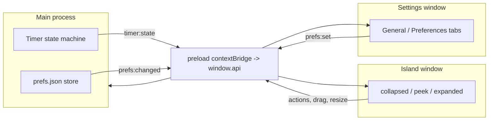

# Pomisland

A macOS notch-aware Pomodoro timer that lives in a "dynamic island" hugging the camera
notch. It glances small, expands on tap, and can be dragged free to float anywhere.

Built with Electron + electron-vite + React + TypeScript, implemented from a Claude Design
handoff (kept in [`design-reference/`](design-reference/)).

## Quick start

```bash
npm install
npm run dev      # launches the island + a tray icon
```

Open Settings from the island's ⋯ menu or the tray. Drag the island near the notch to snap
it; drag it away to float.

> If `npm run dev` ever exits immediately complaining that `app` is undefined, your shell has
> `ELECTRON_RUN_AS_NODE=1` set (it makes Electron run as plain Node). The `dev`/`preview`
> scripts already strip it via `env -u`, but unset it in your shell if you invoke Electron
> directly.

## Scripts

| Script              | What it does                                            |
| ------------------- | ------------------------------------------------------- |
| `npm run dev`       | electron-vite dev with HMR for both renderers           |
| `npm run build`     | Build main, preload, and both renderers into `out/`     |
| `npm run preview`   | Run the production build locally                         |
| `npm run typecheck` | `tsc --noEmit` for the renderer and the node projects   |
| `npm run lint`      | ESLint over `*.ts/*.tsx`                                 |
| `npm run package`   | Build + `electron-builder --mac --dir`                  |

## Architecture

The **main process owns the timer runtime and preferences** (the single source of truth).
Two thin renderer windows subscribe over IPC and render; all mutations flow back through IPC.
Because both windows read the same broadcast state, changing the accent or theme in Settings
instantly reskins the island. See [`CONTEXT.md`](CONTEXT.md) and [`docs/adr/`](docs/adr/).



## Project structure

```
electron/        Main process: main, windows, timer, store, ipc, tray, preload
src/shared/      IPC contract types, design tokens, accent/format helpers
src/island/      Island renderer (collapsed/peek/expanded, ring, dots, menu, drag, chime)
src/settings/    Settings renderer (General + Preferences tabs, live theming, persistence)
design-reference/ The original Claude Design handoff (.dc.html + Folio tokens)
docs/adr/        Architecture decision records
.scratch/        Local markdown issue tracker (see docs/agents/)
```

## What's implemented vs deferred

**Working now:** all three island presentations with the ported completion animations
(burst / echo / heartbeat / bloom plus breathe + urgent amber), the full timer state
machine driven by persisted durations, drag + magnetic notch snap, the complete Settings
panel (General + Preferences tabs from `SettingsPanel.dc.html`) with live theme/accent
re-skin and a live "Done animation" preview, persistence across restart, tray lifecycle,
always-on-top, a synthesized completion chime, and a **global show/hide shortcut**
(`⌘⌥P` / `Ctrl+Alt+P`).

**Deferred to a follow-up** (persisted as preferences but not yet wired to the OS — see
[ADR-0004](docs/adr/0004-defer-os-integrations.md)): launch-at-login, do-not-disturb,
hide-during-screen-sharing, pause-when-idle, the start/pause global shortcut (the "⌥ Space"
shown in Settings), native notifications, the ticking sound, real bundled alarm sound files,
and the alternate timer-style / notch-layout renderings (the island currently always draws
the circular ring). The collapsed island also snaps to the top of the work area rather than
literally wrapping the hardware notch outline.

> **Animations are intentionally un-tuned.** The completion/breathe/peek/transition timings
> are ports of the design prototype; fine-tuning their feel (durations, easing, choreography)
> is a deliberate **later-stage** task.
