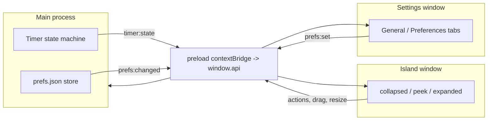

# Pomoisland

A macOS notch-aware Pomodoro timer that lives in a "dynamic island" hugging the camera
notch. It glances small, expands on tap, and can be dragged free to float anywhere.

Built with Electron + electron-vite + React + TypeScript, implemented from a Claude Design
handoff (kept in [`design-reference/`](design-reference/)).

## Quick start

```bash
npm install
npm run dev      # launches the island + a tray icon
```

Open Settings from the island's ⋯ menu or the tray. Drag the island near the notch to snap
it; drag it away to float.

> If `npm run dev` ever exits immediately complaining that `app` is undefined, your shell has
> `ELECTRON_RUN_AS_NODE=1` set (it makes Electron run as plain Node). The `dev`/`preview`
> scripts already strip it via `env -u`, but unset it in your shell if you invoke Electron
> directly.

## Scripts

| Script              | What it does                                            |
| ------------------- | ------------------------------------------------------- |
| `npm run dev`       | electron-vite dev with HMR for both renderers           |
| `npm run build`     | Build main, preload, and both renderers into `out/`     |
| `npm run preview`   | Run the production build locally                         |
| `npm run typecheck` | `tsc --noEmit` for the renderer and the node projects   |
| `npm run lint`      | ESLint over `*.ts/*.tsx`                                 |
| `npm run package`   | Build + `electron-builder --mac --dir` (unsigned `.app`, for smoke tests) |
| `npm run dist:mac`  | Build + signed/notarized `.dmg` + `.zip` (needs Apple creds — see below) |

## Packaging & distribution

`electron-builder.js` builds a macOS **menu-bar utility** (`appId: dev.retro.pomoisland`,
`LSUIElement` → no Dock icon). Only compiled output in `out/` is shipped; the app declares no
production `dependencies`, so dev-only tools (e.g. `node-web-audio-api`, used solely by
`npm run audio:check`) can never end up in the bundle.

> The config is JS (not YAML) so it can `require('dotenv').config()` before exporting the
> config object — this loads `.env` into `process.env` before electron-builder reads Apple/GH
> credentials, regardless of whether `electron-builder` is invoked via an npm script, an IDE,
> CI, or directly on the command line.

```bash
npm run package    # unsigned .app at release/mac-<arch>/Pomoisland.app — for local testing
npm run dist:mac   # signed + notarized .dmg / .zip at release/ — for distribution
```

> **First launch starts fresh (past rename only).** Preferences live in
> `~/Library/Application Support/<app name>/prefs.json`, keyed off the app's name
> (`productName`/package `name`), not `appId` — so the `appId` change to `dev.retro.pomoisland`
> (previously `com.pomoisland.app`) does not by itself reset existing users' prefs. A prior
> product rename that also changed the app name did reset prefs once (`store.ts` already
> tolerates the missing file going forward).

### Signing & notarization prerequisites

`npm run package` (`--dir`) works with **no Apple account** — it skips signing and produces a
locally launchable, unquarantined `.app`. A distributable, Gatekeeper-passing build
(`npm run dist:mac`) additionally requires:

1. **Apple Developer Program** membership (Developer ID distribution).
2. A **"Developer ID Application"** certificate available to the build, via either the login
   keychain or, for CI, `CSC_LINK` (base64 `.p12`) + `CSC_KEY_PASSWORD`.
3. **Notarization credentials** in a `.env` file at the repo root (copy from `.env.example`) — loaded automatically by `electron-builder.js` (via `dotenv`) whenever `electron-builder --mac` runs:

   ```bash
   export APPLE_ID="you@example.com"
   export APPLE_APP_SPECIFIC_PASSWORD="xxxx-xxxx-xxxx-xxxx"   # appleid.apple.com → App-Specific Passwords
   export APPLE_TEAM_ID="ABCDE12345"
   ```

   …or an App Store Connect API key (recommended for CI):

   ```bash
   export APPLE_API_KEY="$(base64 -i AuthKey_XXXX.p8)"
   export APPLE_API_KEY_ID="KEYID"
   export APPLE_API_ISSUER="issuer-uuid"
   export APPLE_TEAM_ID="ABCDE12345"
   ```

Hardened runtime is on, with entitlements in `build/entitlements.mac.plist` (the minimal
JIT/unsigned-memory/library-validation set Electron needs; no mic/camera/network — Pomoisland
only *plays* synthesized audio). Verify a finished build with `spctl --assess --type execute -vv`.

> **App icon.** Ships from the design handoff (`design-reference/project/Icon Export.dc.html` →
> Variant D / `pill-top`, exported as `build/icon.png`). Alternate variants (E and others) live in
> `design-reference/project/icons/`. To swap, copy the desired `AppIcon-*-1024.png` over
> `build/icon.png` and repackage.
>
> **Menu-bar tray icon.** Uses the Variant D iconset exports in `build/tray/` (16 pt + 22 pt,
> @1x/@2x). While a focus/break block is active the tray also shows a live `mm:ss` title beside
> the icon. Source PNGs: `design-reference/project/icons/PomodoroFocus-D.iconset/`.

## Architecture

The **main process owns the timer runtime and preferences** (the single source of truth).
Two thin renderer windows subscribe over IPC and render; all mutations flow back through IPC.
Because both windows read the same broadcast state, changing the accent or theme in Settings
instantly reskins the island. See [`CONTEXT.md`](CONTEXT.md) and [`docs/adr/`](docs/adr/).



## Project structure

```
electron/        Main process: main, windows, timer, store, ipc, tray, preload
src/shared/      IPC contract types, design tokens, accent/format helpers
src/island/      Island renderer (collapsed/peek/expanded, ring, dots, menu, drag, chime)
src/settings/    Settings renderer (General + Preferences tabs, live theming, persistence)
design-reference/ The original Claude Design handoff (.dc.html + Folio tokens)
docs/adr/        Architecture decision records
.scratch/        Local markdown issue tracker (see docs/agents/)
```

## What's implemented vs deferred

**Working now:** all three island presentations with the ported completion animations
(burst / echo / heartbeat / bloom plus breathe + urgent amber), the full timer state
machine driven by persisted durations, drag + magnetic notch snap, the complete Settings
panel (General + Preferences tabs from `SettingsPanel.dc.html`) with live theme/accent
re-skin and a live "Done animation" preview, persistence across restart, tray lifecycle,
always-on-top, a synthesized completion chime, and a **global show/hide shortcut**
(`⌘⌥P` / `Ctrl+Alt+P`).

**Deferred to a follow-up** (persisted as preferences but not yet wired to the OS — see
[ADR-0004](docs/adr/0004-defer-os-integrations.md)): launch-at-login, do-not-disturb,
hide-during-screen-sharing, pause-when-idle, the start/pause global shortcut (the "⌥ Space"
shown in Settings), native notifications, the ticking sound, real bundled alarm sound files,
and the alternate timer-style / notch-layout renderings (the island currently always draws
the circular ring). The collapsed island also snaps to the top of the work area rather than
literally wrapping the hardware notch outline.

> **Animations are intentionally un-tuned.** The completion/breathe/peek/transition timings
> are ports of the design prototype; fine-tuning their feel (durations, easing, choreography)
> is a deliberate **later-stage** task.
